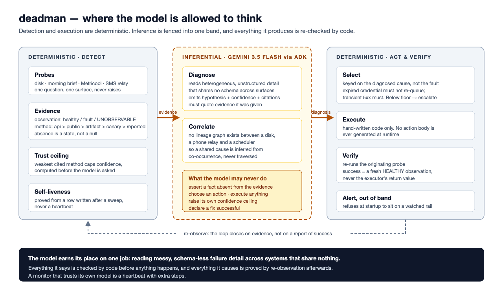

# deadman

**A monitor for the failures that do not page anyone: the ones where a system
keeps reporting success and quietly stops doing its job.**

Threshold monitoring answers "is this number bad right now". That catches
crashes and misses the expensive class of failure entirely. A scheduled job
that runs daily, exits zero, and delivers nothing looks identical to a healthy
one from outside. A volume that has been filling for three weeks is fine until
the morning it is not. A post the scheduler marks published, that never
appeared on the platform, is green everywhere you would think to look.

This was built after a comms rail captured nothing for **24 days** behind a
green heartbeat. Nobody ignored an alert. There was no alert.



## What it does differently

**Absence is a state, not a null.** Every observation is `HEALTHY`, `FAULT`, or
`UNOBSERVABLE`. That third one is not a verdict about the surface, it is a
verdict about our ability to see it, and conflating them is how monitors lie.
A credentials error means we are blind, not that the dataset is stale. Blind
spots are reported on their own line and never counted as healthy.

**How you learned something is part of what you learned.** "The platform's API
confirms the post exists" and "the scheduler says it published" are different
claims about the world. Each piece of evidence carries its method, ranked, and
the weakest method cited caps the confidence of anything built on it. That
ceiling is computed by code before the model is asked, and the model cannot
raise it.

**Liveness is proved by capture, never by heartbeat.** A probe does not ask
whether a job ran. It asks whether the job's *output* exists and how old it is,
read from inside the record rather than from file mtime, because a checkout or
an rsync rewrites mtime and turns a freshness check green with nothing having
run. deadman applies the same rule to itself.

**Silence is ambiguous, so some surfaces get an active canary.** No traffic and
a dead rail look the same. The SMS relay probe sends its own message and reads
the destination back rather than inferring health from quiet.

**Rate, not level.** The disk probe fires on a healthy volume with a bad trend.
A level check would have said "fine" every day for three weeks; a slope says
"you have nine days".

## Where the model is allowed to think

The interesting design constraint is not using an LLM. It is fencing it.

Detection is deterministic. Execution is deterministic. Verification is
deterministic. The model does one job that code genuinely cannot: reading
messy, schema-less failure detail across systems that share no vocabulary, and
proposing *why*.

Everything it says is then checked before anything happens:

- it must quote evidence it was actually given, verbatim, or the answer is
  thrown out whole
- it cannot assert a fact absent from the evidence
- it cannot raise its own confidence ceiling
- it cannot choose an action, and it never generates one
- it cannot declare a fix successful

Action selection keys on the diagnosed *cause*, not the fault. An expired
credential must not re-queue, because that fails identically and burns the
rate limit. A transient 5xx should retry immediately. Same symptom, opposite
correct response, which is exactly the distinction a fault class cannot make
and a diagnosis can.

Then the loop closes on evidence: after remediation the originating probe is
re-run, and only a fresh `HEALTHY` observation counts as success. The
executor's own return value never does. A remediation that reports success
without re-observing is just another heartbeat.

## What it looks like

```json
{
  "surfaces": [
    {"surface": "host:disk/", "observation": "healthy", "method": "local_artifact"},
    {"surface": "cron:morning-brief", "observation": "unobservable", "method": "reported"}
  ],
  "blind_spots": ["cron:morning-brief"],
  "healthy_count": 1,
  "fault_count": 0,
  "blind_count": 1
}
```

Two surfaces, one healthy, and `healthy_count` is 1 rather than 2. A threshold
monitor would call that a clean run.

Live: **https://deadman-mrapac5nda-uc.a.run.app**

More in [`sample-outputs/`](sample-outputs/), all of it regenerated by
[`scripts/generate_samples.py`](scripts/generate_samples.py) and never
hand-written. A test regenerates and compares byte for byte, so a sample
tidied by hand fails the suite.

## Run it

```bash
git clone https://github.com/fivedollarfridays/deadman.git
cd deadman
python3 -m venv .venv && . .venv/bin/activate
pip install -e '.[dev]' -c constraints.txt
pytest -n auto --dist=worksteal -q
```

The suite is hermetic: sockets are blocked for every test, with a live canary
test asserting the block is actually in place. It needs no credentials and
touches no network.

The demo, and the self-check a scheduler would call:

```bash
python scripts/demo.py                       # no network
deadman-self-check --log /path/to/self-evidence.jsonl
```

For the live Gemini path and deploying to Cloud Run, see
[`docs/gemini-verification.md`](docs/gemini-verification.md) and
[`infra/README.md`](infra/README.md). The demo script and its rehearsed
runtime are in [`docs/DEMO.md`](docs/DEMO.md).

## Built for All Things Agentic

Gemini 3.5 Flash through the Agent Development Kit, deployed on Cloud Run via
Cloud Build. The live model call is verified and documented in
[`docs/gemini-verification.md`](docs/gemini-verification.md), including the
two findings that cost a build each: `gemini-3.5-flash` is served only from
the `global` Vertex endpoint, and a fresh service account returns 403 for
about a minute before its IAM binding takes effect.

## Known limits

Stated here rather than left to be discovered.

- **Self-evidence does not survive a cold start.** Cloud Run's filesystem is
  per-instance and ephemeral, so the deployed service proves an instance's
  liveness, not the service's. Durable self-evidence is v2.
- **Instagram and Facebook destinations are unreadable**, so the Metricool
  surface carries a declared permanent blind spot rather than a pretend check.
  X is verifiable. See [`docs/metricool-verification.md`](docs/metricool-verification.md).
- **The demo does not heal every time.** Roughly one live run in four, Gemini
  returns a correct-sounding hypothesis citing nothing, grounding rejects it,
  and nothing acts. That is the design working, and `docs/DEMO.md` says to
  narrate it rather than re-roll.
- **Most recorded model responses are authored, not captured.** They carry
  `captured: false` and say so. One real capture is committed and replayed by
  its own test.
- **Four surfaces, not a general registry.** Adding a surface means writing a
  probe, not editing config. That is v2.
